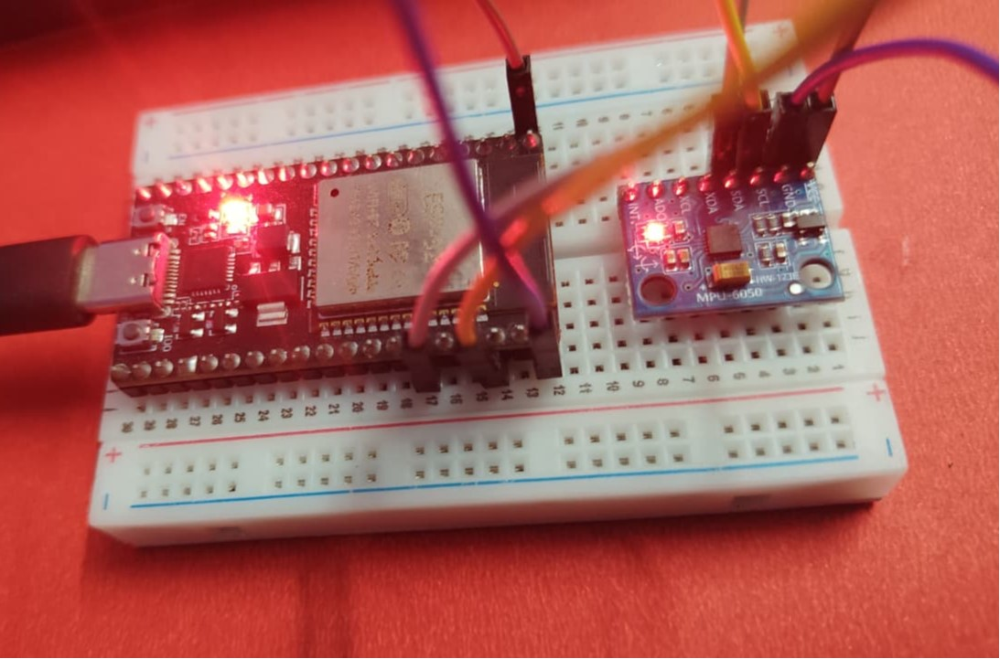
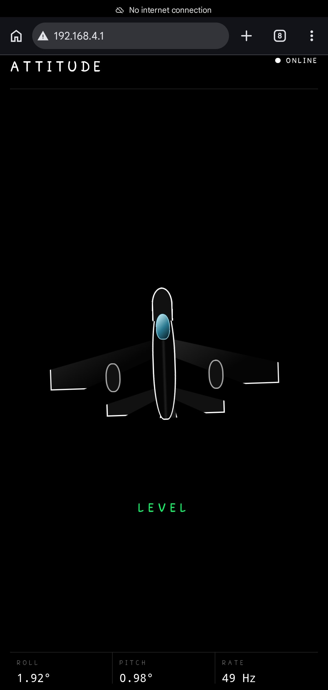

# ESP32 MPU6050 Real-Time Attitude Visualizer

A real-time embedded attitude visualization system built with an ESP32 and MPU6050 IMU.

The ESP32 reads accelerometer and gyroscope data from the MPU6050 over I²C, performs sensor calibration and complementary filtering, and streams roll/pitch telemetry to a browser over Wi-Fi using binary WebSocket communication.

The browser renders the received orientation data as a live 3D aircraft-style visualization.

---

## Project Overview

This project demonstrates how a microcontroller can acquire motion data from an IMU, process that data in real time, and expose the result through a wireless browser-based interface.

The system combines:

* ESP32 dual-core processing
* MPU6050 6-axis IMU
* I²C communication
* Accelerometer and gyroscope data acquisition
* Sensor calibration
* Complementary filtering
* Real-time roll and pitch estimation
* FreeRTOS task management
* Wi-Fi Access Point mode
* HTTP server
* Binary WebSocket communication
* HTML/CSS/JavaScript
* 3D browser visualization
* C++ object-oriented architecture
* PlatformIO development workflow

---

## Physical Hardware

### ESP32 + MPU6050

<div align="center">
  
</div>

**Image placeholder:** Replace the image above with an actual photograph of the assembled physical hardware.

The physical setup consists of:

* ESP32 NodeMCU-32S
* GY-521 MPU6050
* Jumper wires
* USB cable

The MPU6050 communicates with the ESP32 using the I²C protocol.

---

## Mobile Dashboard

The ESP32 hosts a real-time browser dashboard that can be opened directly from a smartphone connected to the ESP32 Wi-Fi Access Point.

<div align="center">
  
</div>

The dashboard displays:

* Connection status
* 3D aircraft visualization
* Roll angle
* Pitch angle
* Level/Tilt status
* Real-time update rate

---

# System Architecture

```text
                         MPU6050
                            |
                            | I²C
                            |
                            v
                    +----------------+
                    |     ESP32       |
                    |                |
                    |  MPU Driver    |
                    +-------+--------+
                            |
                            v
                  +-------------------+
                  | Sensor Manager    |
                  |                   |
                  | 100 Hz Sampling   |
                  +---------+---------+
                            |
                            v
                  +-------------------+
                  | Orientation       |
                  | Filter            |
                  |                   |
                  | Complementary     |
                  | Filter            |
                  +---------+---------+
                            |
                            v
                     Roll / Pitch
                            |
                            v
                  +-------------------+
                  | WebServerManager  |
                  |                   |
                  | HTTP + WebSocket  |
                  +---------+---------+
                            |
                            | Wi-Fi
                            v
                     PHONE / PC
                            |
                            v
                  +-------------------+
                  | Browser Dashboard |
                  |                   |
                  | HTML/CSS/JS       |
                  | 3D Visualization  |
                  +-------------------+
```

---

# Data Flow

```text
MPU6050
   |
   | Raw Accelerometer + Gyroscope Data
   v
Mpu6050
   |
   | Calibration
   v
SensorManager
   |
   | Sensor Samples
   v
OrientationFilter
   |
   | Roll + Pitch
   v
SensorManager
   |
   | Thread-Safe Snapshot
   v
WebServerManager
   |
   | Binary WebSocket Packet
   v
Browser
   |
   | JavaScript
   v
3D Aircraft
```

---

# Hardware

## Components

| Component         |    Quantity | Purpose                | Approx. Cost |
| ----------------- | ----------: | ---------------------- | -----------: |
| ESP32 NodeMCU-32S |           1 | Main microcontroller   |         ₹399 |
| GY-521 MPU6050    |           1 | 6-axis IMU             |    ₹100–₹200 |
| Jumper Wires      | As required | Electrical connections |     Existing |
| USB Cable         |           1 | Programming and power  |     Existing |
| Breadboard        |           1 | Prototyping            |     Optional |

### Approximate Hardware Cost

```text
ESP32 NodeMCU-32S     ₹399
GY-521 MPU6050        ₹100–₹200
--------------------------------
Approx. Total         ₹499–₹599
```

Prices vary depending on supplier and location.

---

# MPU6050

The MPU6050 is a 6-axis Inertial Measurement Unit (IMU).

It contains:

```text
MPU6050
   |
   +-- 3-Axis Accelerometer
   |      |
   |      +-- X Acceleration
   |      +-- Y Acceleration
   |      +-- Z Acceleration
   |
   +-- 3-Axis Gyroscope
          |
          +-- X Angular Velocity
          +-- Y Angular Velocity
          +-- Z Angular Velocity
```

The accelerometer measures acceleration, including the acceleration caused by Earth's gravity.

The gyroscope measures angular velocity.

Combining these measurements allows the ESP32 to estimate the orientation of the sensor.

---

# Wiring

The MPU6050 communicates with the ESP32 through I²C.

## ESP32 to MPU6050

| ESP32 NodeMCU-32S | MPU6050 | Purpose   |
| ----------------- | ------- | --------- |
| 3.3V              | VCC     | Power     |
| GND               | GND     | Ground    |
| GPIO 22           | SCL     | I²C Clock |
| GPIO 21           | SDA     | I²C Data  |

```text
ESP32 NodeMCU-32S             GY-521 MPU6050
------------------------------------------------

3.3V   ---------------------> VCC
GND    ---------------------> GND

GPIO 22 ---------------------> SCL
GPIO 21 ---------------------> SDA
```

The following MPU6050 pins are not required by the current implementation:

```text
XDA
XCL
AD0
INT
```

The `AD0` pin determines the I²C address. With AD0 LOW, the MPU6050 normally uses:

```text
0x68
```

---

# I²C Configuration

The current implementation uses:

```text
SDA            = GPIO 21
SCL            = GPIO 22
I²C Frequency  = 400 kHz
```

The MPU6050 device address is:

```text
0x68
```

The driver also accepts a device reporting:

```text
WHO_AM_I = 0x70
```

This provides compatibility with MPU6050-compatible modules that report a different identity value.

---

# Sensor Configuration

The current MPU6050 driver configures the sensor with:

```text
Accelerometer : ±2g
Gyroscope     : ±250 °/s
I²C           : 400 kHz
```

The driver reads a complete sensor frame containing:

```text
Accelerometer X
Accelerometer Y
Accelerometer Z
Temperature
Gyroscope X
Gyroscope Y
Gyroscope Z
```

---

# Sensor Calibration

Raw IMU measurements contain sensor offsets.

When the board is stationary and placed approximately flat, the expected accelerometer readings are:

```text
X ≈ 0g
Y ≈ 0g
Z ≈ +1g
```

The actual raw readings may contain offsets.

The firmware therefore performs startup calibration.

The calibration process:

```text
MPU6050
   |
   v
Collect Multiple Samples
   |
   v
Calculate Average
   |
   v
Determine Sensor Offsets
   |
   v
Apply Offset Correction
```

The current implementation collects approximately 1000 samples during calibration.

The board must remain stationary during this process.

---

# Orientation Estimation

The system estimates two primary orientation angles:

```text
Roll
Pitch
```

## Roll

Roll is calculated from the accelerometer Y and Z axes:

```text
roll = atan2(Y, Z)
```

## Pitch

Pitch is calculated using:

```text
pitch = atan2(
    -X,
    sqrt(Y² + Z²)
)
```

The accelerometer provides a gravity-based reference for the orientation.

---

# Gyroscope Integration

The gyroscope measures angular velocity rather than absolute orientation.

For example:

```text
Gyroscope X
     |
     | Angular Velocity
     v
Integration over Time
     |
     v
Estimated Rotation
```

The gyroscope responds quickly to movement, but integration introduces accumulated error.

This error is known as gyroscope drift.

---

# Complementary Filter

The project combines accelerometer and gyroscope measurements using a complementary filter.

Current filter coefficient:

```text
Alpha = 0.98
```

Conceptually:

```text
                    +-------------------+
Accelerometer ----->|                   |
                    | Complementary     |----> Roll
Gyroscope --------->| Filter            |
                    |                   |----> Pitch
                    +-------------------+
```

The filter combines the two estimates:

```text
Filtered Angle =
    0.98 × Gyroscope Estimate
    +
    0.02 × Accelerometer Estimate
```

The gyroscope provides responsive short-term motion tracking.

The accelerometer provides a long-term reference using gravity.

This combination produces a more stable roll and pitch estimate than relying on either sensor alone.

---

# Important Limitation: Yaw

The MPU6050 does not contain a magnetometer.

Therefore, the current implementation cannot determine absolute compass heading.

The available sensors are:

```text
Accelerometer
Gyroscope
```

Therefore:

```text
Roll          → Available
Pitch         → Available
Absolute Yaw  → Not available
```

Gyroscope-based yaw integration can be implemented, but it will drift over time.

A future version can add a magnetometer or use a 9-axis IMU for absolute heading estimation.

---

# FreeRTOS Architecture

The ESP32 uses a dual-core processor.

The project separates sensor processing and networking into dedicated FreeRTOS tasks.

```text
                         ESP32
                    +-------------+
                    |             |
                    |  Dual Core  |
                    |             |
                    +------+------+
                           |
              +------------+------------+
              |                         |
              v                         v
           CORE 1                    CORE 0
              |                         |
              v                         v
        Sensor Task                Network Task
              |                         |
              v                         v
           MPU6050                  HTTP Server
           Filtering              WebSocket Server
```

## Core 1 — Sensor Task

The sensor processing task runs on Core 1.

Responsibilities:

* Read MPU6050
* Calculate sample timing
* Apply orientation filtering
* Calculate roll
* Calculate pitch
* Determine level state
* Update shared sensor state

The task runs approximately every:

```text
10 ms
```

which corresponds to approximately:

```text
100 Hz
```

---

# Core 0 — Network Task

The networking task runs on Core 0.

Responsibilities:

* HTTP server
* WebSocket server
* WebSocket event handling
* Sensor snapshot retrieval
* Binary telemetry transmission

The browser telemetry is transmitted approximately every:

```text
20 ms
```

which corresponds to approximately:

```text
50 Hz
```

---

# Thread-Safe Sensor State

The sensor task writes orientation data while the network task reads it.

Because these operations occur in different FreeRTOS tasks, shared data is protected using a critical section.

```text
Sensor Task
     |
     | WRITE
     v
+------------------+
| Shared Snapshot  |
+------------------+
     ^
     | READ
     |
Network Task
```

This prevents the network task from reading inconsistent or partially updated sensor data.

---

# Wi-Fi Access Point

The ESP32 operates as a Wi-Fi Access Point.

The smartphone connects directly to the ESP32.

```text
             Wi-Fi
PHONE --------------------> ESP32
                              |
                              +-- HTTP Server
                              |
                              +-- WebSocket Server
```

Current network configuration:

```text
SSID:
ESP32-MPU6050

Password:
12345678

IP Address:
192.168.4.1
```

Internet access is not required.

---

# HTTP Server

The ESP32 hosts the browser dashboard through an HTTP server.

```text
HTTP Port:
80
```

The web interface is embedded directly inside the firmware using program memory.

LittleFS/SPIFFS is not required for the current dashboard.

The architecture is therefore:

```text
ESP32 Flash
    |
    +-- Firmware
    +-- Embedded HTML
    +-- Embedded CSS
    +-- Embedded JavaScript
```

The browser accesses:

```text
http://192.168.4.1
```

---

# WebSocket Communication

After loading the dashboard, the browser establishes a persistent WebSocket connection.

```text
Browser
   |
   | WebSocket
   v
ESP32
```

The WebSocket server runs on:

```text
Port 81
```

Connection endpoint:

```text
ws://192.168.4.1:81/
```

WebSocket is used because the application requires continuous real-time telemetry.

---

# Binary Telemetry Protocol

The project uses binary WebSocket packets instead of JSON.

Each telemetry packet contains:

```text
float     roll
float     pitch
uint8_t   level
uint32_t  sequence
```

Total packet size:

```text
13 bytes
```

Conceptually:

```text
+----------+----------+-------+----------+
|   Roll   |  Pitch   | Level | Sequence |
|  4 bytes |  4 bytes | 1 byte| 4 bytes  |
+----------+----------+-------+----------+
```

Using binary telemetry avoids unnecessary text formatting and reduces communication overhead.

---

# Browser Data Flow

```text
MPU6050
   |
   v
Sensor Task
   |
   v
Orientation Filter
   |
   v
Shared Sensor Snapshot
   |
   v
Network Task
   |
   v
Binary WebSocket
   |
   v
JavaScript
   |
   +---- Roll
   |
   +---- Pitch
   |
   +---- Level
   |
   v
3D Aircraft
```

---

# 3D Visualization

The browser dashboard uses:

```text
HTML
CSS
JavaScript
```

The aircraft visualization is constructed using CSS 3D elements.

The browser receives roll and pitch values and applies them to the aircraft using CSS transforms.

Conceptually:

```text
Roll
 |
 v
JavaScript
 |
 v
rotateZ()

Pitch
 |
 v
JavaScript
 |
 v
rotateX()

       +----------------+
       |  3D AIRCRAFT   |
       +----------------+
```

The interface uses a dark, minimal dashboard design suitable for a real-time embedded telemetry display.

---

# Level Detection

The system uses a configurable level tolerance.

Current tolerance:

```text
±5°
```

The aircraft is considered level when:

```text
abs(roll)  <= 5°
AND
abs(pitch) <= 5°
```

Otherwise the dashboard indicates that the system is tilted.

```text
             LEVEL

       Roll  = 2.0°
       Pitch = 1.0°

          [ LEVEL ]
```

---

# Project Structure

```text
ESP32_MPU-6050/
│
├── include/
│
├── lib/
│
├── src/
│   │
│   ├── main.cpp
│   │
│   ├── Mpu6050.cpp
│   ├── Mpu6050.h
│   │
│   ├── OrientationFilter.cpp
│   ├── OrientationFilter.h
│   │
│   ├── SensorManager.cpp
│   ├── SensorManager.h
│   │
│   ├── WebServerManager.cpp
│   └── WebServerManager.h
│
├── test/
│
├── .gitignore
├── platformio.ini
└── README.md
```

---

# Software Architecture

## `main.cpp`

Application orchestration layer.

Responsibilities:

* Serial initialization
* MPU6050 initialization
* Calibration
* Orientation initialization
* Sensor manager initialization
* Web server initialization

The main file intentionally contains minimal application logic.

---

## `Mpu6050.cpp / Mpu6050.h`

Hardware abstraction layer for the MPU6050.

Responsibilities:

* I²C initialization
* Device identification
* Register configuration
* Raw sensor reads
* Accelerometer conversion
* Gyroscope conversion
* Calibration
* Offset correction

---

## `OrientationFilter.cpp / OrientationFilter.h`

Orientation processing layer.

Responsibilities:

* Accelerometer angle calculation
* Gyroscope integration
* Complementary filtering
* Roll calculation
* Pitch calculation
* Level detection

The filter is separated from the hardware driver so sensor communication and mathematical processing remain independent.

---

## `SensorManager.cpp / SensorManager.h`

Real-time sensor processing layer.

Responsibilities:

* FreeRTOS task creation
* Core assignment
* Sensor sampling
* Timing
* Orientation updates
* Shared sensor state
* Thread-safe snapshots

---

## `WebServerManager.cpp / WebServerManager.h`

Networking and browser communication layer.

Responsibilities:

* Wi-Fi Access Point
* HTTP server
* WebSocket server
* Embedded webpage
* Binary telemetry
* Client handling

---

# Why This Architecture?

The project separates responsibilities instead of placing the complete application inside `main.cpp`.

Instead of:

```text
main.cpp
 |
 +-- Sensor
 +-- Calibration
 +-- Filtering
 +-- Wi-Fi
 +-- HTTP
 +-- WebSocket
 +-- HTML
 +-- JavaScript
```

the project is organized as:

```text
main
 |
 +-- Mpu6050
 |
 +-- OrientationFilter
 |
 +-- SensorManager
 |
 +-- WebServerManager
```

This provides:

* Better maintainability
* Easier debugging
* Clear responsibility boundaries
* Easier testing
* Easier future expansion
* Cleaner embedded software architecture

---

# Development Environment

```text
Operating System : Windows 10
IDE              : Visual Studio Code
Build System     : PlatformIO
Framework        : Arduino
Language         : C++
Board            : ESP32 NodeMCU-32S
RTOS             : FreeRTOS
Sensor Interface : I²C
Network          : Wi-Fi
Protocol         : WebSocket
Visualization    : HTML / CSS / JavaScript
```

---

# PlatformIO

The project uses PlatformIO for building, uploading and managing the ESP32 firmware.

Example configuration:

```ini
[env:nodemcu-32s]
platform = espressif32
board = nodemcu-32s
framework = arduino
monitor_speed = 115200

lib_deps =
    links2004/WebSockets
```

---

# Installation

## 1. Clone the Repository

```bash
git clone https://github.com/wasim-shakir5/ESP32_MPU-6050.git
```

Open the project in Visual Studio Code with PlatformIO installed.

---

## 2. Connect the Hardware

Connect the MPU6050 to the ESP32:

```text
ESP32       MPU6050
--------------------
3.3V   ---> VCC
GND    ---> GND
GPIO21 ---> SDA
GPIO22 ---> SCL
```

---

## 3. Build the Project

Using PlatformIO:

```text
Build
```

Or from the terminal:

```bash
pio run
```

---

## 4. Upload the Firmware

Connect the ESP32 through USB.

Using PlatformIO:

```text
Upload
```

Or:

```bash
pio run --target upload
```

---

## 5. Open Serial Monitor

Set the serial monitor to:

```text
115200 baud
```

The firmware will initialize the MPU6050 and perform calibration.

---

# Startup Sequence

```text
ESP32 Boot
    |
    v
Serial Initialization
    |
    v
MPU6050 Initialization
    |
    v
WHO_AM_I Check
    |
    v
Sensor Configuration
    |
    v
Calibration
    |
    v
Orientation Initialization
    |
    v
Sensor Task Started
    |
    v
Wi-Fi AP Started
    |
    v
HTTP Server Started
    |
    v
WebSocket Started
    |
    v
SYSTEM READY
```

---

# Using the Dashboard

After uploading the firmware:

1. Power the ESP32.
2. Open Wi-Fi settings on your phone.
3. Connect to:

```text
ESP32-MPU6050
```

4. Enter the password:

```text
12345678
```

5. Open:

```text
http://192.168.4.1
```

6. Keep the MPU6050 stationary during startup calibration.
7. Move the sensor and observe the aircraft orientation.

---

# Calibration Procedure

Calibration must be performed while the MPU6050 is stationary.

Place the board on a stable, approximately flat surface.

During startup:

```text
DO NOT MOVE THE MPU6050
```

The firmware collects multiple measurements and calculates the sensor offsets.

```text
        MPU6050
           |
           v
    Multiple Samples
           |
           v
     Calculate Mean
           |
           v
    Sensor Offsets
           |
           v
     Normal Operation
```

Moving the board during calibration can produce incorrect offset values.

---

# Testing

## Test 1 — Device Detection

Verify that the Serial Monitor reports successful MPU6050 initialization.

Supported device identification:

```text
0x68
```

or:

```text
0x70
```

---

## Test 2 — Accelerometer

When the board is approximately level:

```text
Accel X ≈ 0g
Accel Y ≈ 0g
Accel Z ≈ 1g
```

Tilting the board should change the accelerometer readings.

---

## Test 3 — Gyroscope

When the board is stationary:

```text
Gyro X ≈ 0 °/s
Gyro Y ≈ 0 °/s
Gyro Z ≈ 0 °/s
```

Moving the board should produce angular velocity.

---

## Test 4 — Orientation

Tilt the board around the X and Y axes.

Observe:

```text
Roll
Pitch
```

on the browser dashboard.

---

## Test 5 — Wi-Fi

Connect the phone to:

```text
ESP32-MPU6050
```

Then open:

```text
http://192.168.4.1
```

The dashboard should load directly from the ESP32.

---

## Test 6 — WebSocket

The dashboard should establish a WebSocket connection.

The live telemetry should update continuously.

---

# Performance

Current application targets:

```text
Sensor Sampling:
≈ 100 Hz

Browser Telemetry:
≈ 50 Hz

Sensor Processing:
Core 1

Network Processing:
Core 0

WebSocket:
Binary
```

The sensor loop operates at a higher frequency than the browser visualization loop.

This allows the orientation filter to process frequent measurements while keeping browser communication practical.

---

# Engineering Concepts Demonstrated

## Embedded C++

```text
Classes
Headers
Source Files
Objects
Encapsulation
Modular Architecture
```

## Hardware

```text
I²C
GPIO
Registers
Sensor Configuration
Raw Sensor Data
```

## Sensor Processing

```text
Calibration
Sampling
Offset Correction
Angle Calculation
Sensor Fusion
Complementary Filtering
```

## Real-Time Systems

```text
FreeRTOS
Tasks
Task Priorities
Core Affinity
Timing
Critical Sections
Shared State
```

## Networking

```text
Wi-Fi Access Point
HTTP
WebSocket
Binary Protocol
Client/Server Communication
```

## Web Development

```text
HTML
CSS
JavaScript
CSS 3D Transforms
Real-Time Visualization
```

---

# Why Binary WebSocket Instead of JSON?

A JSON packet might look like:

```json
{
  "roll": 2.1,
  "pitch": -0.8,
  "level": true
}
```

JSON is easy to debug, but it requires text formatting and parsing.

This project instead uses a compact binary packet:

```text
float roll
float pitch
uint8_t level
uint32_t sequence
```

This reduces the telemetry payload and demonstrates a communication approach commonly used in embedded systems where bandwidth and processing overhead matter.

---

# Why Process the Sensor on the ESP32?

The ESP32 could send raw measurements to the browser and perform all calculations in JavaScript.

This project instead performs calibration and orientation estimation on the ESP32.

```text
                    ESP32
                      |
                +-----+-----+
                |           |
                v           v
            MPU6050     Networking
                |
                v
           Calibration
                |
                v
        Orientation Filter
                |
                v
           Roll / Pitch
                |
                v
          Binary WebSocket
                |
                v
             Browser
                |
                v
         3D Visualization
```

This creates a clear separation between embedded processing and presentation.

---

# Wokwi Simulation

The physical hardware is the primary implementation.

A simplified Wokwi circuit can be represented using:

```json
{
  "version": 1,
  "author": "ESP32 MPU6050 Attitude Visualizer",
  "editor": "wokwi",
  "parts": [
    {
      "type": "board-esp32-devkit-c-v4",
      "id": "esp32",
      "top": 0,
      "left": 0,
      "attrs": {}
    },
    {
      "type": "wokwi-mpu6050",
      "id": "mpu",
      "top": -10,
      "left": 250,
      "attrs": {}
    }
  ],
  "connections": [
    [
      "esp32:3V3",
      "mpu:VCC",
      "red",
      []
    ],
    [
      "esp32:GND.1",
      "mpu:GND",
      "black",
      []
    ],
    [
      "esp32:21",
      "mpu:SDA",
      "green",
      []
    ],
    [
      "esp32:22",
      "mpu:SCL",
      "blue",
      []
    ]
  ],
  "dependencies": {}
}
```

---

# Learning Resources

## ESP32 WebSocket

[ESP32 WebSocket Tutorial](https://www.youtube.com/watch?v=ZbX-l1Dl4N4)

Useful for understanding the basic WebSocket architecture used between the ESP32 and browser.

## ESP32 Web Server + WebSocket

[ESP32 WebSocket Server Tutorial](https://www.youtube.com/watch?v=mkXsmCgvy0k)

Useful for understanding real-time browser communication using an ESP32.

---

# Future Improvements

Potential future versions:

```text
[ ] 9-axis sensor support
[ ] Absolute yaw estimation
[ ] Magnetometer integration
[ ] Quaternion-based orientation
[ ] Madgwick filter
[ ] Mahony filter
[ ] Runtime calibration
[ ] Configurable filter parameters
[ ] Sensor diagnostic dashboard
[ ] Raw sensor telemetry
[ ] Orientation history graphs
[ ] Packet-loss detection
[ ] WebSocket reconnect handling
[ ] Browser-based calibration
[ ] OTA firmware updates
```

---

# Project Status

```text
ESP32 MPU6050 ATTITUDE VISUALIZER
---------------------------------

MPU6050 Detection        ✓
I²C Communication        ✓
Sensor Calibration       ✓
Accelerometer Reading    ✓
Gyroscope Reading        ✓
Roll Calculation         ✓
Pitch Calculation        ✓
Complementary Filter     ✓
FreeRTOS Sensor Task     ✓
Dual-Core Architecture   ✓
Wi-Fi Access Point       ✓
HTTP Server              ✓
WebSocket Server         ✓
Binary Telemetry         ✓
3D Browser Dashboard     ✓
Mobile Visualization     ✓
```

---

# Complete System

```text
                   PHYSICAL WORLD
                         |
                         v
                    MPU6050 IMU
                         |
                         | I²C
                         v
                  ESP32 NodeMCU-32S
                         |
              +----------+----------+
              |                     |
              v                     v
        Sensor Task             Network Task
          Core 1                   Core 0
              |                     |
              v                     v
        Sensor Fusion        HTTP / WebSocket
              |                     |
              +----------+----------+
                         |
                         | Wi-Fi
                         v
                       PHONE
                         |
                         v
                 Browser Dashboard
                         |
                         v
                   3D Aircraft
```

---

# End-to-End Pipeline

```text
Physical Motion
      ↓
MPU6050
      ↓
I²C
      ↓
ESP32
      ↓
Sensor Calibration
      ↓
Complementary Filter
      ↓
Roll / Pitch Estimation
      ↓
Binary WebSocket
      ↓
Wi-Fi
      ↓
JavaScript
      ↓
3D Aircraft Visualization
```

---

# Repository

[GitHub Repository](https://github.com/wasim-shakir5/ESP32_MPU6050_Attitude_Visualizer)

---

# Author

**Wasim Shakir**

Embedded Systems | IoT | C++ | ESP32 | FreeRTOS | Web Technologies

---

# License

This project can be released under the MIT License.

```text
MIT License
```
